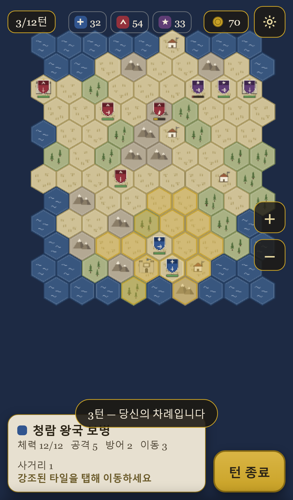
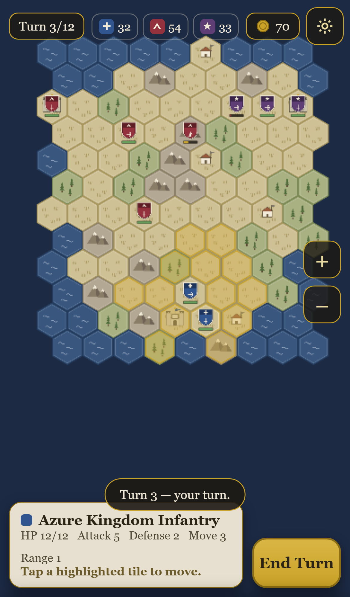
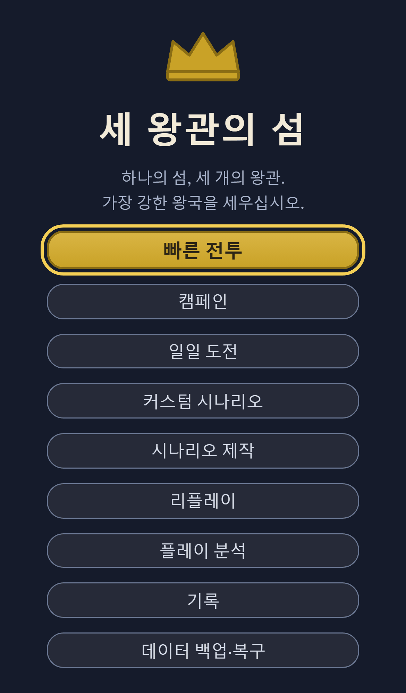
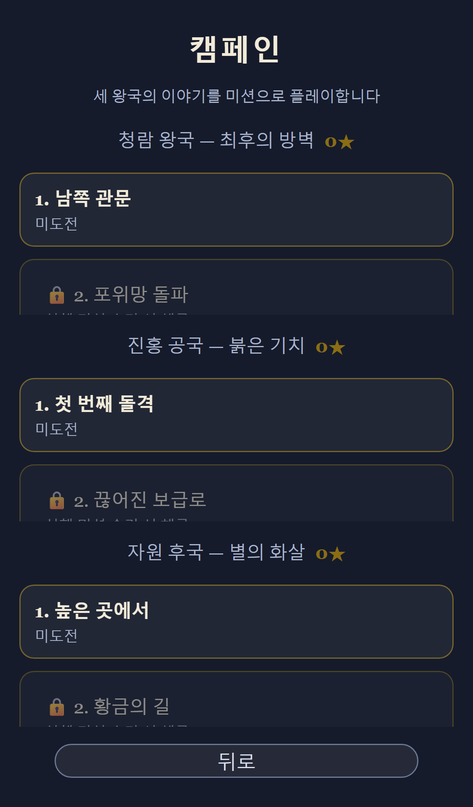
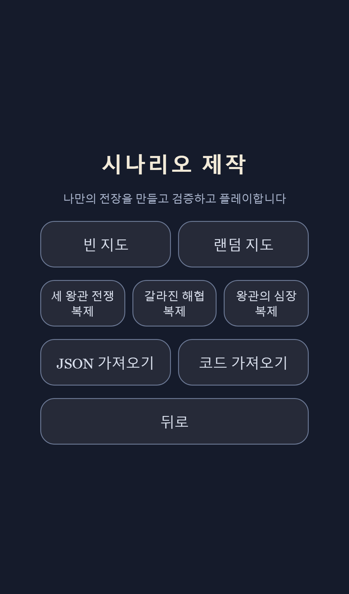
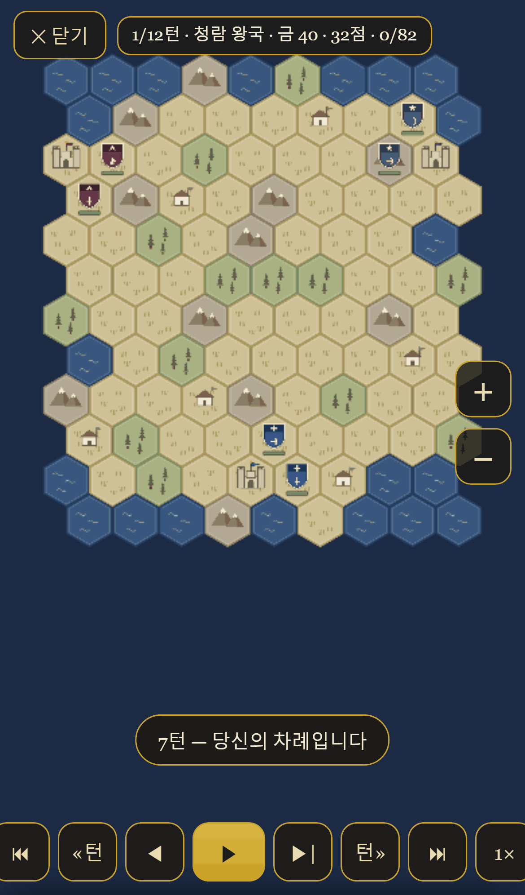

# 세 왕관의 섬 (Three Crowns Island)

하나의 섬을 두고 세 왕국이 겨루는 모바일 우선 육각 턴제 전략게임이자 전장 제작 플랫폼. 빠른 전투뿐 아니라 왕국별 캠페인, 모바일 시나리오 제작실, 커스텀 전장 공유, 결정론적 리플레이를 지원한다.

<p align="center">
  
  
</p>

<p align="center"></p>

## ▶ Play Now

**https://bn8624.github.io/kkk/**

아이폰 Safari와 PC 브라우저에서 설치 없이 바로 플레이. 브라우저를 닫아도 자동 저장되어 이어할 수 있다.

## 세 왕국 · 최종 6병종

공용 보병·궁병·기병 + 왕국 고유 병종 1기씩.

| 왕국 | 플레이 스타일 | 교리 | 고유 병종 | 시작 |
| --- | --- | --- | --- | --- |
| 🔵 청람 왕국 | 수비와 규율 | **보루** — 보병이 숲·산·거점에서 방어 +1 | **수호대** — 미이동 시 방어 +1 | 보병+궁병, 금 34 |
| 🔴 진홍 공국 | 기동과 공격 | **돌격** — 기병이 이동 후 공격하면 공격 +2 | **약탈대** — 숲1·산2, 점령 금 +5 | 기병+보병, 금 42 |
| 🟣 자원 후국 | 사격과 경제 | **장궁** — 궁병의 사거리 +1 | **쇠뇌대** — 기본 방어 최대 2 관통 | 궁병·기병, 금 65 |

## 세 시나리오

- **세 왕관 전쟁** — 표준 전장. 적 수도를 모두 점령하거나 12턴 뒤 최고 점수로 승리
- **갈라진 해협** — 해협이 섬을 가른다. 좁은 육교의 병목을 장악하라
- **왕관의 심장** — 3라운드에 열리는 중앙 왕관을 4턴 연속 확보하면 승리 (경합 시 정지)

모든 지도는 시드 기반으로 생성되고 자동 검증(연결성·공정성)을 거친다. 같은 시드는 항상 같은 전장이다.

## 캠페인

<p align="center"></p>

세 왕국은 서로 다른 3개 미션, 총 9개 미션을 가진다. 선행 미션을 승리하면 다음 미션이 열리고, 별·최고 점수·최단 턴·최고 생존 병력이 브라우저에 저장된다.

- **청람 왕국 — 최후의 방벽**: 수도 방어, 포위망 돌파, 세 성문 생존전
- **진홍 공국 — 붉은 기치**: 제한 턴 점령, 보급로 차단, 왕관 연속 보유
- **자원 후국 — 별의 화살**: 지정 궁병 생존, 경제 점수, 두 수도 정복

## 시나리오 제작실과 공유

<p align="center"></p>

6×6부터 20×20까지 지형·거점·유닛·세력·목표를 편집할 수 있다. 드래그 브러시, 100단계 undo/redo, 자동 저장, 검증, 실제 엔진 테스트 플레이를 제공한다. 완성한 전장은 JSON 파일·텍스트·압축 공유 코드·URL 해시로 내보내고 다시 가져올 수 있다.

가장 작은 문서 형태는 아래와 같다. 실제 문서의 `tiles`에는 보드의 모든 좌표가 들어가며, 가져오기 전에 구조·참조·경로·즉시 승패 가능성을 검증한다.

```json
{
  "schemaVersion": 1,
  "id": "my-island",
  "title": "나의 전장",
  "description": "직접 만든 6×6 전장",
  "board": { "cols": 6, "rows": 6, "tiles": [], "source": { "kind": "fixed" } },
  "factions": [],
  "units": [],
  "rules": { "maxTurns": 12, "turnLimit": "score" },
  "victoryConditions": [{ "type": "conquest" }],
  "defeatConditions": [{ "type": "human-eliminated" }]
}
```

## 결정론적 리플레이

<p align="center"></p>

게임의 이동·공격·생산·턴 종료를 정본 명령으로 기록한다. 보관함에서 재생·일시정지·명령 앞뒤 이동·턴 이동·1×/2×/4× 배속·가져오기·내보내기를 사용할 수 있으며, 재생 결과는 정본 상태 다이제스트로 검증된다.

**호환 정책:** 1.5.x·2.0.x 비-crown 리플레이는 exact 재생. 2.0.x crown-heart 는 왕관 규칙 변경으로 재생 전용(playable-unverified). 2.1.x·2.2.x 는 exact.

## 게임 모드

- **빠른 전투** — 왕국·시나리오·난이도·시드를 골라 즉시 시작
- **캠페인** — 왕국별 3개, 총 9개 목표형 미션과 별·해금 진행
- **일일 도전** — 날짜 기반 결정론적 시드. 오늘은 모두가 같은 전장, 같은 왕국, 같은 수정자. 최고 점수는 로컬에 기록되고 결과를 공유할 수 있다
- **커스텀 시나리오** — 제작실에서 저장하거나 가져온 전장을 실제 게임 엔진으로 플레이
- **시나리오 제작** — 모바일·PC 전장 편집, 검증, 테스트 플레이, 공유
- **리플레이** — 자동 기록된 게임을 명령 단위로 재생하고 파일로 공유
- **이어하기** — 자동 저장된 판 재개 (AI 턴 도중 새로고침해도 안전)

난이도는 쉬움·보통·어려움 3단계로, 자원 치트 없이 AI 의사결정 수준만 달라진다. 어려움은 반격 위험 평가·집중 공격·지형 활용·적응 생산을 수행한다.

## 조작법

| 조작 | 동작 |
| --- | --- |
| 유닛 탭 | 선택, 이동 범위(금색)·공격 대상(붉은색) 표시 |
| 강조 타일 탭 | 이동 (마을·수도에 올라서면 점령) |
| 붉은 칸의 적 탭 | 1탭 = 전투 예측 표시, 재탭 = 공격 확정 |
| 내 거점(빈 타일) 탭 | 유닛 생산 시트 열기 |
| 드래그 / 두 손가락 | 지도 이동 / 확대·축소 (+·− 버튼도 지원) |
| 턴 종료 버튼 | AI 두 세력이 행동 후 다음 턴 시작 (2배속·건너뛰기 지원) |

## 개발·테스트

```bash
npm install
npm run dev           # http://localhost:5173
npm run build         # 타입 검사 + 프로덕션 빌드(dist/)
npm test              # 코어 로직 단위 테스트(Vitest)
npm run test:e2e      # Playwright E2E — Chromium·WebKit 모바일 + PC smoke
                      #   (최초 1회 npx playwright install chromium webkit)
npm run test:e2e:dist # 테스트용 dist 화이트박스 + 공개 dist 블랙박스 E2E
npm run simulate      # 1,000게임+ 밸런스 시뮬레이션 → artifacts/balance-summary.md
npm run determinism   # 500개+ 실제 기록·재생 다이제스트 검증
npm run simulate:campaign # 9개 미션 900게임+ 안정성·승리 가능성 검증
npm run lint          # ESLint
npm run package:itch  # itch.io 업로드용 three-crowns-island.zip 생성
npm run release:assets # dist 기반 2.2 업로드 묶음과 SHA-256 체크섬 생성
npm run simulate:units # 고유 병종 사용률 시뮬
npm run audit:rosters  # 병종 역할 매트릭스
```

`main`에 푸시하면 GitHub Actions가 lint·타입·단위 테스트·프로덕션 빌드·멀티브라우저 E2E를 모두 통과한 경우에만 GitHub Pages에 배포한다. 배포판에는 테스트 브리지가 포함되지 않는다.

밸런스 수치는 [src/core/doctrines.ts](src/core/doctrines.ts)·[src/core/data.ts](src/core/data.ts)·[src/core/units.ts](src/core/units.ts)에 모여 있고, 시뮬레이션 허용 기준은 [scripts/simulate.ts](scripts/simulate.ts)와 [scripts/unit-sim.ts](scripts/unit-sim.ts)가 검증한다.

## itch.io 배포

`npm run package:itch`로 생성한 `three-crowns-island.zip`을 HTML 게임으로 업로드한다.

- 게임 설명 초안: *하나의 섬, 세 왕국, 최종 6병종. 빠른 전투·9개 미션 캠페인·모바일 전장 제작실·결정론적 리플레이·플레이 분석·일일 도전을 브라우저에서 바로 플레이. 청람 수호대·진홍 약탈대·자원 쇠뇌대. 한국어·영어, 오프라인 PWA.*
- 권장 설정: 화면 방향 자유(세로·가로 모두 지원), 모바일 지원 체크, 대표 이미지는 `public/og-image.png`
- 버전: 2.2.2

## 저장소 이름 변경

저장소 이름은 제품명으로 사용되지 않는다. GitHub에서 저장소 이름을 바꾼 뒤 Pages 설정에서 `main`의 Actions 배포를 유지하고, 위 README의 공개 URL만 새 Pages URL로 갱신하면 된다. Vite `base`, Open Graph 이미지, PWA `start_url`·`scope`, 앱 내부 공유 링크는 모두 상대 경로 또는 현재 브라우저 주소를 사용한다.

## English

Three Crowns Island is a mobile-first, deterministic hex strategy game and scenario workshop. Version **2.2** finalizes the six-unit combat roster: shared infantry/archer/cavalry plus kingdom uniques — Azure **Guardian** (brace defense), Crimson **Raider** (terrain mobility + plunder gold), Violet **Crossbow** (armor piercing). It also includes quick battles, nine campaign missions, a daily challenge, six official battlefields, a mobile editor, replay playback, local playtest analysis, Korean/English UI, offline PWA play, and full/selective data backup.

- Play online at **https://bn8624.github.io/kkk/** or install it from your browser's Add to Home Screen menu.
- Choose **Settings** to switch languages immediately.
- All saves, replays, scenarios, and analysis data stay on this device; no analytics server is used.
- Use **Data management** to export a full backup before clearing browser data or moving devices.
- Existing 1.5 saves remain supported. Replay compatibility: 1.5.x and 2.0.x non-crown are exact; 2.0.x crown-heart is playable-unverified (rules changed); 2.1.x and 2.2.1+ are exact; 2.2.0 is migratable (legacy guardian digest verified then upgraded).
- For contributors: run `npm ci`, `npm run lint`, `npm run typecheck`, `npm test`, `npm run simulate:units`, `npm run audit:rosters`, and `npm run test:e2e:dist` before submitting changes.

See [the 2.2.2 release notes](docs/RELEASE_NOTES_2.2.2.md), [the 2.2.1 release notes](docs/RELEASE_NOTES_2.2.1.md), [the 2.2.0 release notes](docs/RELEASE_NOTES_2.2.0.md), and [the physical iPhone checklist](docs/IPHONE_CHECKLIST.md) for release details.

## 그래픽 에셋 교체

현재 모든 그래픽(지형·유닛 토큰·건물·하이라이트)은 코드로 생성한 벡터 그래픽이다. 게임 로직은 중앙 에셋 ID(`terrain.plains`, `unit.infantry.azure`, `building.capital.crimson` 등)만 참조하므로, 외부 일러스트로 교체할 때 게임 코드를 수정할 필요가 없다.

1. 이미지 파일(PNG·SVG)을 `public/art/` 등에 넣는다.
2. [src/render/external-assets.ts](src/render/external-assets.ts)에 등록한다.

```ts
export const EXTERNAL_ASSETS: Record<string, string> = {
  'terrain.plains': './art/plains.png',
  'unit.infantry.azure': './art/knight-blue.png',
};
```

등록된 ID는 해당 이미지를 사용하고, 등록되지 않은 ID는 계속 코드 생성 그래픽을 사용한다. 전체 ID 목록은 [src/render/assets.ts](src/render/assets.ts)의 `AssetId` 타입 참고.

## 라이선스

MIT
